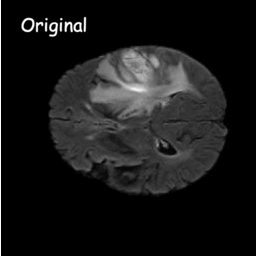

# Liver Segmentation
Experimental platform over liver segmentation algorithms in CT scans.

# Results

| Model      | Cuts per Image | Batch Size | Epoch | Val_IoU |
|------------|:--------------:|:----------:|:-----:|:-------:|
| MSA        |        1       |      4     |   88  |  0.669  |
| MSA        |        3       |            |       |         |
| MedSAM     |        1       |            |       |         |
| MedSAM     |        3       |            |       |         |
| UNet++     |        1       |      8     |   91  |  0.588  |
| UNet++     |        3       |            |       |         |
| MedSegDiff |        1       |            |       |         |
| MedSegDiff |        3       |            |       |         |
| UNetr      |        1       |            |       |         |
| Unetr      |        3       |            |       |         |
| HybridGNet |        1       |      4     |  N/A  |   N/A   |
| HybridGNet |        3       |            |       |         |

# MedSAM


## Training

# MSA (Medical Sam Adapter)


## Training

### Training from scratch
``` python
python train.py -net sam -mod sam_adpt -exp_name Lits2017_Liver_Only -image_size 512 -dataset lits -data_path ../datasets/Lits/imgs_1ch/liver_only/ -in_channels 1 -b 4
```

### Fine Tuning
``` python
python train.py -net sam -mod sam_adpt -exp_name Lits2017_Liver_Only -image_size 512 -dataset lits -data_path ../datasets/Lits/imgs_1ch/liver_only/ -in_channels 1 -b 4 -weights ./checkpoint/checkpoint_best.pth
```

Note: log file will be saved on the -weights experiment log folder. Checkpoints are saved in the actual experiment checkpoint folder.

### Continuing Training
``` python
python train.py -net sam -mod sam_adpt -exp_name Lits2017_Liver_Only -image_size 512 -dataset lits -data_path ../datasets/Lits/imgs_1ch/liver_only/ -in_channels 1 -b 4 -epoch_ini 40 -weights ./checkpoint/checkpoint_best.pth
```

# HybridGNet


## Training

### Training from scratch
``` python
python3 trainerHybrid.py --name HybridGNet --inputsize 512 --extended --epochs 100
```

Note: Batch size is 4 by default. This can me modified in line 329 of trainerHybrid.py.
Note: extended uses the whole data, if this is not added, the model will be trained on the split 1, consisting of 50% random-selected data subset.

--load

# MedSegDiff



## Training

