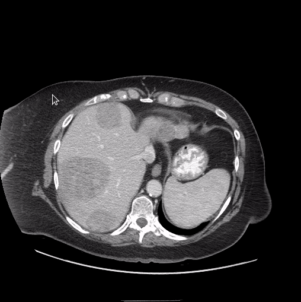
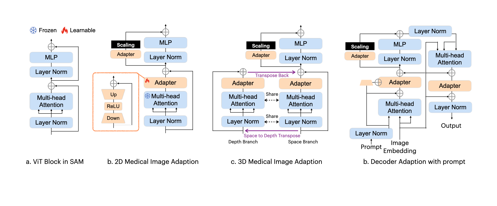
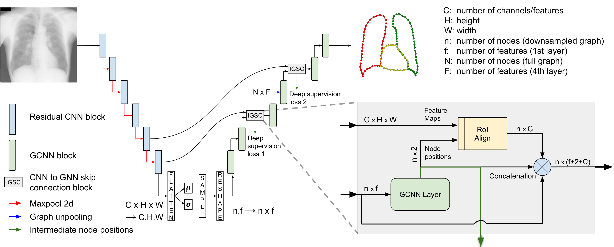

# Liver Segmentation
Experimental platform over liver segmentation algorithms in CT scans.

# Results

| Model      | Cuts per Image | Batch Size | Epoch | Val_IoU |
|------------|:--------------:|:----------:|:-----:|:-------:|
| MSA        |        1       |      36     |   145  |  0.935  |
| MSA        |        3       |      36     |   98   |   0.937 |
| MedSAM     |        1       |       4     |   29   |    0.952|
| MedSAM     |        3       |       4     |   39   |   0.960 |
| UNet++     |        1       |      18     |   91   |  0.948  |
| UNet++     |        3       |      18     |   59   | 0.949   |
| nnUNET     |        1       |      120    |   68   | 0.950   |
| nnUNET     |        3       |      120    |   67   |  0.959  |
| UNET-EffB0 |        1       |      16     |  143   |  0.959  |
| UNET-EffB0 |        3       |      16     |  263   |  0.970  |
| HybridGNet |        1       |      120    |  129   |   0.566 |
| HybridGNet |        3       |      120    |  148   |   0.627 |
| MaskFormer (SWIN) |     1    |  8        |      23800    |  0.948   |
| Mask2Former (SWIN) |    1    |  8       |      24200    |  0.947   |

# MedSAM



## Training

# MSA (Medical Sam Adapter)



## Training

### Training from scratch
``` python
python train.py -net sam -mod sam_adpt -exp_name Lits2017_Liver_Only -image_size 512 -dataset lits -data_path ../datasets/Lits/imgs_1ch/liver_only/ -in_channels 1 -b 4
```

### Fine Tuning
``` python
python train.py -net sam -mod sam_adpt -exp_name Lits2017_Liver_Only -image_size 512 -dataset lits -data_path ../datasets/Lits/imgs_1ch/liver_only/ -in_channels 1 -b 4 -weights ./checkpoint/checkpoint_best.pth
```

Note: log file will be saved on the -weights experiment log folder. Checkpoints are saved in the actual experiment checkpoint folder.

### Continuing Training
``` python
python train.py -net sam -mod sam_adpt -exp_name Lits2017_Liver_Only -image_size 512 -dataset lits -data_path ../datasets/Lits/imgs_1ch/liver_only/ -in_channels 1 -b 4 -epoch_ini 40 -weights ./checkpoint/checkpoint_best.pth
```

# HybridGNet



## Training

### Training from scratch
``` python
python3 trainerHybrid.py --name HybridGNet --inputsize 512 --extended --epochs 100
```

Note: Batch size is 4 by default. This can me modified in line 329 of trainerHybrid.py.
Note: extended uses the whole data, if this is not added, the model will be trained on the split 1, consisting of 50% random-selected data subset.

--load

## Training

# UNet++

## Training

### Training from scratch
``` python
python3 trainerHybrid.py --name HybridGNet --inputsize 512 --extended --epochs 100
```

# nnUNet

## Training

### Training from scratch
``` python
python3 trainerHybrid.py --name HybridGNet --inputsize 512 --extended --epochs 100
```


# UNET-EffB0

## Training

### Training from scratch
``` python
python3 trainerHybrid.py --name HybridGNet --inputsize 512 --extended --epochs 100
```

# MaskFormer (SWIN)

## Training

### Training from scratch
``` python
python3 trainerHybrid.py --name HybridGNet --inputsize 512 --extended --epochs 100
```

# Mask2Former (SWIN)

## Training

### Training from scratch
``` python
python3 trainerHybrid.py --name HybridGNet --inputsize 512 --extended --epochs 100
```

# TotalSegmentator

## Training

### Training from scratch
``` python
python3 trainerHybrid.py --name HybridGNet --inputsize 512 --extended --epochs 100
```
